# Cloudera 5.4 Service Configuration

### Adding Cloudera services
Select on the arrow next to cluster name and select Add a Service per picture below
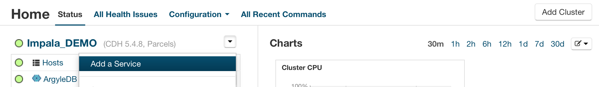

From list of services pick the service you want to add
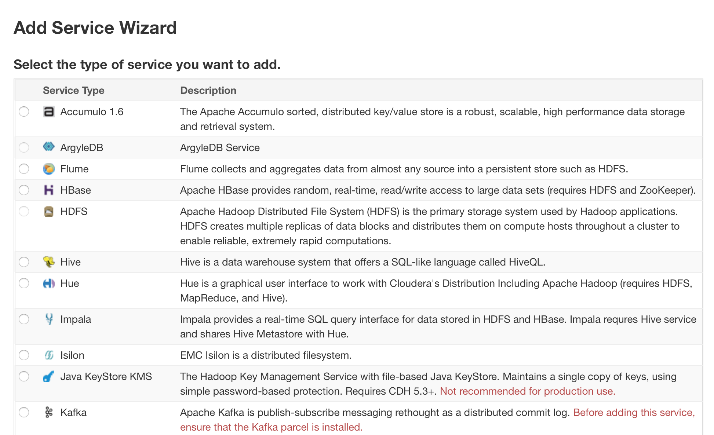

### Adding the Flume service
Follow Adding Cloudera services above and Select continue to accept defaults below
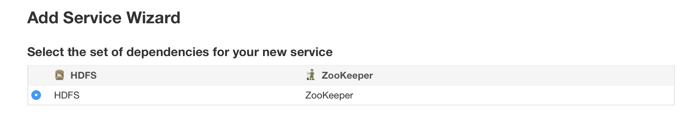

Select on Flume agent selection field and select hosts you want to have the agent on from the list of available hosts and Select continue and finish
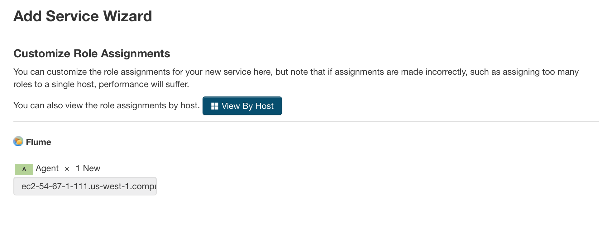

### Adding the Accumulo service
Follow Adding Cloudera services above and Select continue to accept defaults below
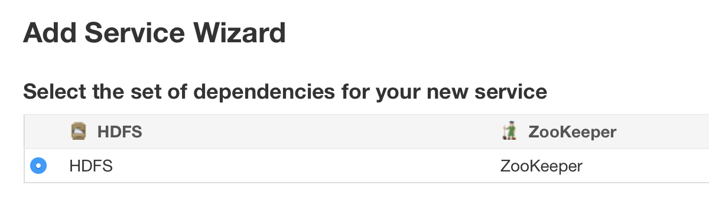

Select on Accumulo master, Tablet Server, Garbage Collector, Monitor, Tracer, Gateway selection fields and select hosts you want to have Accumulo on from the list of available hosts and Select continue

Make sure the values below match what you have on screen and set Root Password field to Argyle standard and Select continue than finish

### Adding the Hive service
Follow Adding Cloudera services above and Select continue to accept defaults below

Select on Gateway, Hive Metastore Server, WebHcat Server, Hiveserver2 selection fields and select hosts you want to have Hive on from the list of available hosts and Select continue.

Select Use Embedded database and Select test connection then Select continue

Leave defaults below as is and Select finish
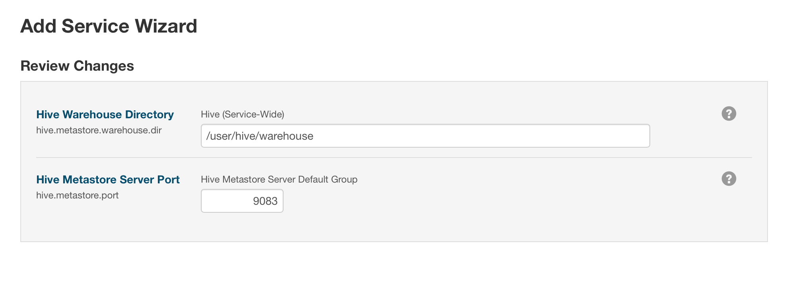

### Adding the Impala service
Follow Adding Cloudera services above and Select continue to accept defaults below

Select on Impala Catalog Server, Impala Satatestore, WImpala Daemon selection fields and select hosts you want to have Hive on from the list of available hosts and Select continue.

Leave defaults as is and Select continue than finish
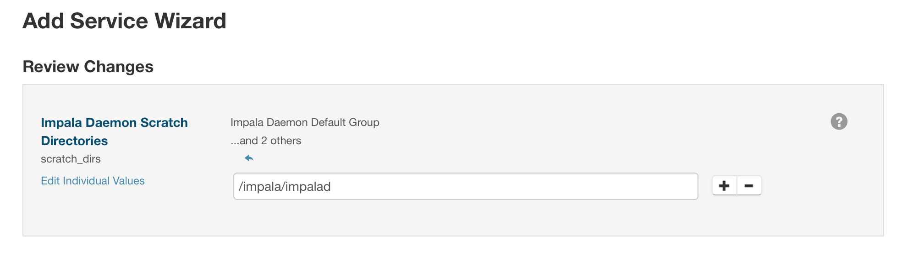

### Adding the ArgyleDB service
Follow Adding Cloudera services above and Select continue to accept defaults below

Select on ArgyleDB Server, Redis Server selection fields and select hosts you want to have ArgyleDB on from the list of available hosts and Select continue.

Set Accumulo user password and PrestoDB discovery URI as below
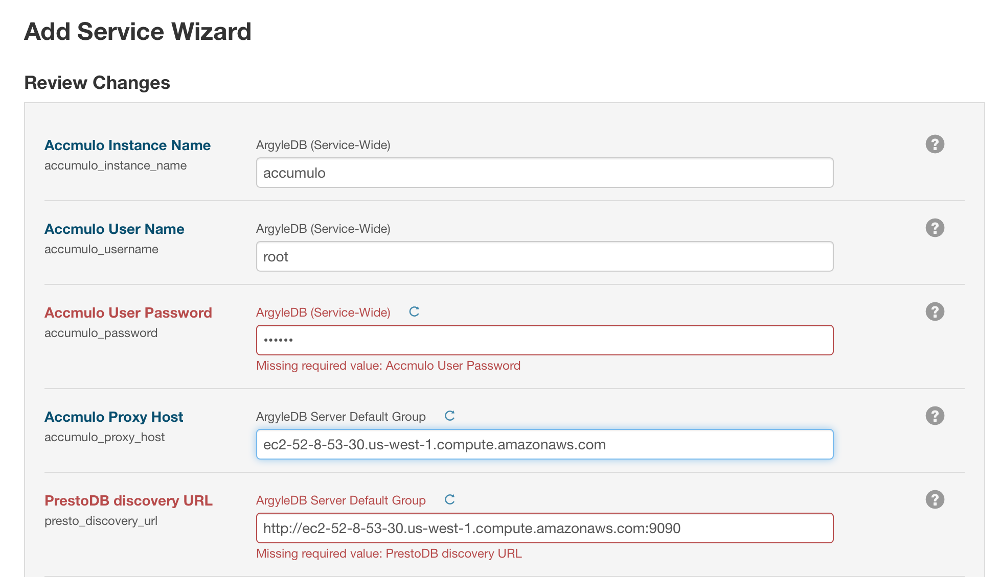

Add Redis server host if localhost set to local otherwise use FQDN name. Add Tableau rest api user. Add Tableau user password for rest apu user. Add api admin user
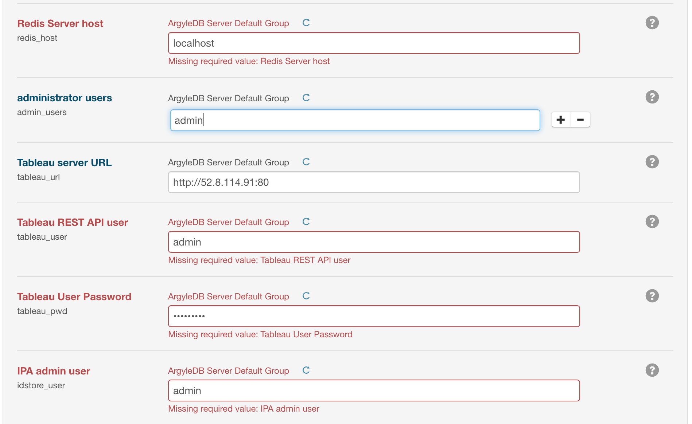

Add ipa admin user password. Add host ipa server. Add ipa cert path

### Adding the PrestoDB service
Follow Adding Cloudera services above and Select continue to accept defaults below
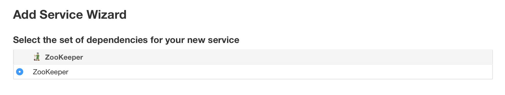

Add Accumulo instance name. Set accumulo password per Argyle records

Leave defaults as is and Select continue then finish

### Adding the IBIS service
Follow adding Cloudera services above and Select continue to accept defaults below
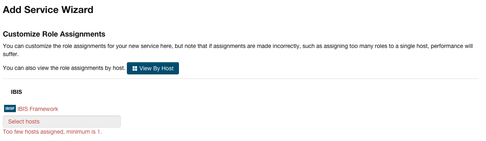

ignore the error during install

